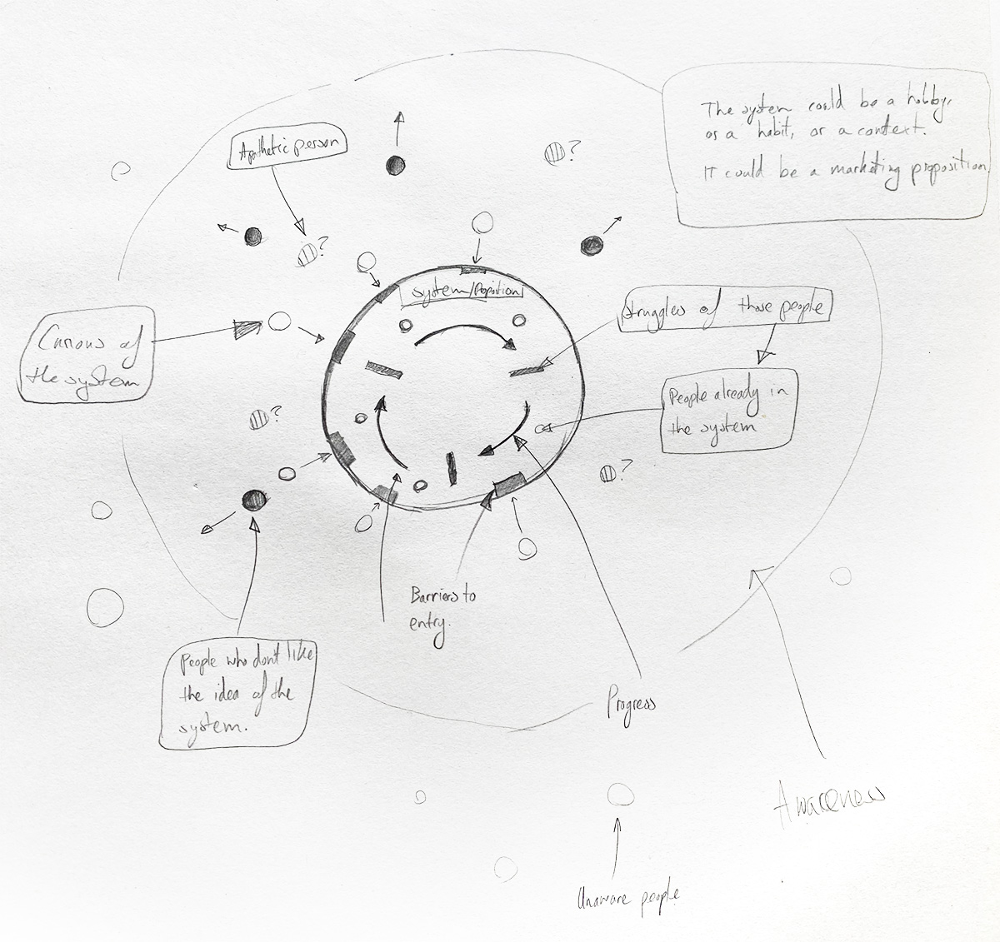

I'm looking for an idea. No wait, I'm looking for a problem. A problem that people have that gets in their way of making progress. One that bothers them so much, they'd be willing to pay for a solution to it - that's a business idea.

One of the best resources I've ever encountered on finding and validating new product ideas is <a href="https://podcast.megamaker.co/episodes/037-find-and-validate-good-product-ideas" target="_blank">this MegaMaker podcast</a> by <a href="https://justinjackson.ca/" target="_blank">Justin Jackson</a>.

There are so many insightful soundbites in this podcast, but the following is a golden nugget that will cause a paradigm shift in the way you understand people. I've roughly paraphrased:

> We must abandon the idea that customers have ‘needs’ and ‘wants’. They only have one need, to make progress within the systems they interact with.
> The reason customers buy products is because they imagine their lives will be better with them, than without.

The struggles people encounter while trying to make progress within those systems are problems to be solved; cue potential product opportunities to help them do that!

Thinking more on this, I realize a system can be anything.
Obviously, as mentioned in the podcast, it could be a system with a location like the New York subway.  
But I think it could also be a hobby, eg. running.

Let's give this idea a whirl. Imagine running was something you knew and enjoyed and so the thought of designing a product to serve runners appealed to you.

What does progress look like for people in the system of running?

> _Desired progress in running:_
>
> - Getting fitter
> - Running further
> - Running faster
> - Running for longer
> - Looking better
> - Running with others

What are the struggles people might encounter as they try to make progress in one of those areas? Let's pick "running further" as an example and imagine some:

> _Running further struggles:_
>
> - Not enough time to run the distance you'd like
> - Uncomfortable running sneakers
> - Injuries
> - Safety running on roads
> - Running out of energy
> - Getting thirsty during the run

Of course, these assumed problems are not founded on real research which is vital when attempting to build a business that will succeed so it would be dangerous to jump in and start building off of them right now. But, with that caveat, after identifying real struggles within our chosen system you can see how this exercise could help us find hypotheses we could use test new product ideas:

> _As a runner I would like a map that shows public water supplies so that I can plan my route around them and run further without getting thirsty_

I took a first pass at sketching a visual model to describe this framework that also touches on the marketing/awareness side of things.

What do you think?

